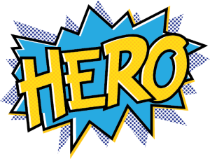
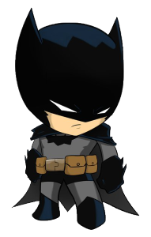

  
  

# Projeto
Desafio Semana OmniStack 11 - <strong>Front-end</strong>

Esse projeto tem por objetivo conectar pessoas que desejam fazer contribuições monetárias a ONG's que precisam de ajuda.

# Tecnologias
Foram utilizadas as seguintes tecnologias:
- [Node.js](https://nodejs.org/en)
- [React](https://reactjs.org)
- [React Native](https://reactnative.dev)
- [Expo](https://expo.io)
